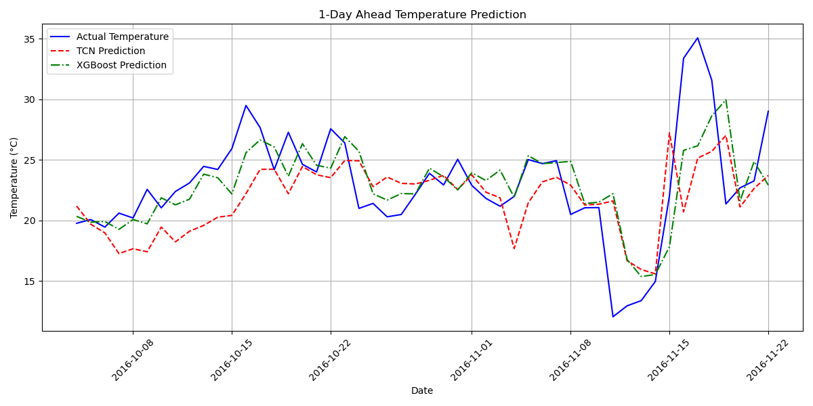

# TCN Weather Forecasting (WaveNet-inspired WeatherNet)

This repository contains a notebook-driven implementation of a WaveNet-inspired Temporal Convolutional Network (TCN) called `WeatherNet` for short-term weather forecasting (multi-step/horizon predictions). The primary notebook is `TSA1.ipynb` which includes data preprocessing, model implementation, training, evaluation, and comparison to an XGBoost baseline.

Below are the exact steps performed in the project (as implemented in `TSA1.ipynb`) and the visual artifacts the notebook saves. Images are embedded below so you can preview the outputs directly from this folder — if an image does not render, ensure the PNG file exists in the same directory as this README.

## Exact steps performed in the notebook

1. Environment & imports
	- Imported PyTorch, numpy, pandas, scikit-learn, matplotlib, XGBoost and supporting libraries.

2. Data inspection & split
	- Loaded a weather DataFrame `df` and inspected it (`df.info()`).
	- Defined `test_size = 90` (last 90 records used for test), split remaining data into training and validation (validation is 10% of training+validation portion).

3. Scaling
	- Standardized features using `StandardScaler()` fit on the training portion and applied to validation and test splits.

4. Sequence creation
	- Implemented `create_sequences(data, seq_length, horizon)` which builds (X, y) pairs for supervised sequence forecasting.
	- Several `seq_length` values are used in different cells (e.g., 30, then later 14). The notebook shows how to generate sequences for a `forecast_horizon` (example: 7 days).

5. PyTorch dataset and dataloaders
	- Converted sequences to PyTorch tensors and transposed X to shape (batch, channels, seq_length).
	- Built `TensorDataset` objects and `DataLoader`s for train/val/test (example `batch_size=8`).

6. Model architecture (WeatherNet)
	- Implemented `CausalDilatedConv1d` that applies padding = (kernel_size-1)*dilation and trims the trailing padded timesteps to preserve causality.
	- Implemented `WeatherNetResidualBlock` with a dilated causal conv that outputs 2*channels, split into filter and gate; applied gated activation (tanh * sigmoid); plus residual and skip 1x1 convolutions.
	- Implemented `WeatherNet` which:
		 - Applies an input 1x1 conv to map input features to residual channels.
		 - Stacks residual blocks with exponentially increasing dilation (dilation = 2**i) across `num_blocks` and `num_layers_per_block`.
		 - Sums skip connections, applies final 1x1 convs, reshapes output to (batch, output_channels, forecast_horizon).

7. Training loop
	- Configured a training function `train_tcn_model(model, train_loader, val_loader, criterion, optimizer, num_epochs, patience)` which:
		 - Runs training epochs, computes train and validation losses (MSE), prints epoch metrics.
		 - Uses early stopping (`patience`) and saves best weights to `best_tcn_model.pth` when validation loss improves.
		 - After training, loads the best checkpoint back into the model.

8. Evaluation of TCN
	- Run test set inference and collected predictions & targets.
	- Saved a model computation graph using `torchviz.make_dot(output, params=dict(model.named_parameters())).render("tcn_model_computation_graph", format="png")`.
	- Calculated per-horizon metrics (MSE, RMSE, MAE) and plotted actual vs predicted for each horizon.
	- Plotted training and validation loss across epochs and saved to `tcn_training_losses.png`.

9. XGBoost baseline
	- Flattened each input sequence into a single vector for per-horizon XGBoost training (`prepare_xgb_data`), trained one XGBoost regressor per forecast day.
	- Trained with `objective='reg:squarederror'`, `eval_metric='rmse'`, early stopping, and appended per-day predictions into `xgb_preds`.
	- Calculated RMSE/MAE per horizon for the XGBoost predictions.
	- Saved feature importance plot for the 1-day ahead model to `xgboost_feature_importance.png`.

10. Comparison & saved artifacts
	- Compared average RMSE across horizons for TCN vs XGBoost.
	- Plotted a sample-based comparison for 1-day ahead temperature prediction and saved to `prediction_comparison.png`.
	- Saved best model weights to `best_tcn_model.pth` and visual artifacts:
		 - `prediction_comparison.png`
		 - `xgboost_feature_importance.png`
		 - `tcn_model_computation_graph.png`
		 - `tcn_training_losses.png`

## Visual artifacts (embedded)

If these files exist in the folder they will render below. If they don't, run the notebook cells that generate them.

### Prediction comparison (1-day ahead)



## Quick run instructions (reproducible steps)

1. Create and activate a Python virtual environment and install packages (example):

```bash
python -m venv .venv
source .venv/bin/activate
pip install --upgrade pip
pip install torch numpy pandas scikit-learn matplotlib xgboost torchviz
```

2. Open `TSA1.ipynb` and run the cells in order. Key cells to inspect or re-run:
	- Data loading & `df.info()`
	- Scaling & `create_sequences`
	- Model class definitions (`CausalDilatedConv1d`, `WeatherNetResidualBlock`, `WeatherNet`)
	- Training loop cell (saves `best_tcn_model.pth`)
	- Evaluation cells that compute metrics and save figures.

3. If torchviz graph generation fails, install Graphviz via Homebrew on macOS:

```bash
brew install graphviz
```

## Artifacts to check in the folder

- `best_tcn_model.pth` — model checkpoint
- `prediction_comparison.png` — predicted vs actual sample plot
- `xgboost_feature_importance.png` — XGBoost 1-day importance
- `tcn_model_computation_graph.png` — torchviz forward-pass graph
- `tcn_training_losses.png` — loss curves

If any images are missing, re-run the corresponding notebook cells to regenerate them. If you want, I can scan the workspace now and confirm which of the images exist and update the README to only embed the ones present.
